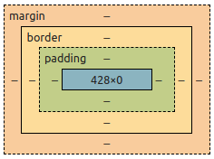
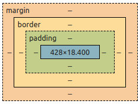
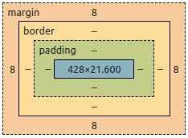
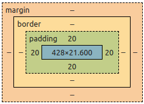
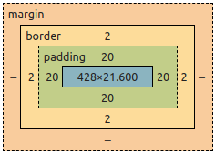
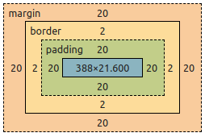
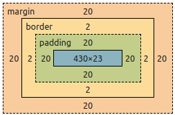
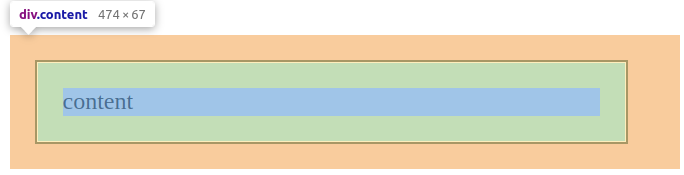
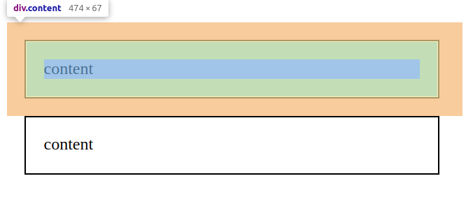
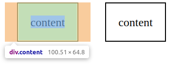

In CSS, every element is rendered as a rectangular box. This is because boxes are predictable shapes, easier to compute, and more developer friendly. In today's post, I will try to explain the **CSS box model**. It will be a beginner-friendly post. We'll start with a brief overview of the model. Then we will get more practical with the code. If you want to jump to the practical, scroll down to "Let's practice" section.

## What is CSS box model?

The browser renders all elements as rectangles. Dubbed the CSS box model, the size of these rectangles are determined by margin, padding, border, and the content itself. Margin is set by the `margin` property and the same applies to the `padding` and `border` properties. Size of the content is determined by the content itself.

<Mermaid content={`graph TD
    subgraph margin [Margin Box]
        subgraph border [Border Box]
            subgraph padding [Padding Box]
                subgraph content [Content Box]
                    ActualContent[Content]
                end
            end
        end
    end
    class margin window
    class border object
    class padding prop
    class content window
`} />

In the diagram above, the CSS box model is made by 4 seperate boxes. The content box, the padding box, the border box, and the box created by the margin.

### Content box

Content box is the inner-most rectangle in the box model. The size of the content box is determined by the content itself. The content can be a text, image, or video.

### Padding box

The padding box is created by the element's `padding` property. The padding box is technically an extension of content box and inherits properties like background color.

The `padding` property is used to increase the element's size which is different from the `margin` property which increases space between the elements.

### Border box

The border box is created by the element's `border` property. The width of the box is determined by the value of `border-width`.

### Margin box

The margin box is created by the element's `margin` property. Unlike other properties, margin is shared with the nearby element. If the nearby element has a bigger margin, then only it is rendered.

## Let's practice

Alright, let's put the theory behind us. Practice makes everything perfect.

We will start by creating an empty `div` element with class "content".

```html
<div class="content"></div>
```

Although the `div` is empty, it still occupies some width. That is is because `div`s are block-level elements and takes the whole line. To see the CSS box model, right click the element and open developer tools.

  

We can see that the element is occupying 428px width and no height. There is no guarantee that you will get the same width as it is dynamically generated by the browser and depends on screen size. Although we can still use `width` and `height` properties to force a defined dimension. We'll get to that later.

**Pro tip:** You can double click the box model and edit the values to play around.

**One more tip:** Instead of `div`, try `span` tag. There will be neither width nor height since it is an inline element.

Now, add the text "content" inside the `div`.

```html
<div class="content">content</div>
```

Some height will be added to the element which is proportional the font size.

  

Let's add some CSS to increase the font size.

```html
<style>
  .content {
    font-size: 1.2rem;
  }
</style>
<div class="content">content</div>
```

1.2 rem increases the font size to 120% of root font size. The height of the content box will increase respectively.

  

Let's add a 20px padding.

```html
<style>
  .content {
    font-size: 1.2rem;
    padding: 20px;
  }
</style>
<div class="content">content</div>
```

The 20px padding actually increases the area of the element by 20 pixels. You can try applying a different background color and see for yourself.

  

Now we will add some border with 2px width.

```html
<style>
  .content {
    font-size: 1.2rem;
    padding: 20px;
    border: 2px solid;
  }
</style>
<div class="content">content</div>
```

The border is generated at the edge of the padding. We can see the 2px width on the box model below.

  

And finally we will add the margin 20px.

```html
<style>
  .content {
    font-size: 1.2rem;
    padding: 20px;
    border: 2px solid;
    margin: 20px;
  }
</style>
<div class="content">content</div>
```

This will give us the complete CSS box model.

  

Notice that the element's content width has changed after adding margin. This is because margin is applied outside the element and will eat off element's content box dimension if it can be taken.

To prevent it, we can use `width` and `height` properties.

```html
<style>
  .content {
    font-size: 1.2rem;
    padding: 20px;
    border: 2px solid;
    margin: 20px;
    width: 430px;
    height: 23px;
  }
</style>
<div class="content">content</div>
```

The `width` and `height` properties will define a permanent width and height for the element's content box. Please remember that we are only able to do this because `div`s are block-level elements. The `width` and `height` properties doesn't work for inline elements.

  

Right now, our content `div` element looks like this.

  

There is a total of 474px width and 67px height. The value displayed is without the margin. This is because margin occupies the area outside the element and is influenced by nearby elements and the screen size.

To further test this, we will create a copy of the `div` element and place it below the current one.

```html
<style>
  .content {
    font-size: 1.2rem;
    padding: 20px;
    border: 2px solid;
    margin: 20px;
    width: 430px;
    height: 23px;
  }
</style>
<div class="content">content</div>
<div class="content">content</div>
```

  

Here the margin is actually shared between the elements. The 20px margin doesn't double as 40px. If one of the elements had greater margin, only that will be rendered. Hence margin only acts like the minimum space between the elements.

To finish this off, I will change the `display` property to `inline`. Two things are expected to happen.

1. The `height` and `width` properties will be ineffective.
2. The two elements will stop occupying their own lines as they're no more block-level elements.

```html
<style>
  .content {
    font-size: 1.2rem;
    padding: 20px;
    border: 2px solid;
    margin: 20px;
    width: 430px;
    height: 23px;
    display: inline;
  }
</style>
<div class="content">content</div>
<div class="content">content</div>
```

  

The width was reduced from 474 to 100. This is because the 430px width is no more effective. Instead, the browser automatically calculates the width of the content box. The same applies to the height property.

We can change the `display` property to `inline-block` to retain the height while disallowing the width.

To summarise,

- Every element in CSS is a rectangular box
- The content box, padding box, border box, and the margin determines the box size.
- The `width` and `height` properties can be used to change size of the content box for block-level elements.
- Margin is shared with the nearby element. If the element has greater margin, only it is rendered.
- Beware of the change in behavior with `display` properties like `block`, `inline`, `inline-block`, etc.