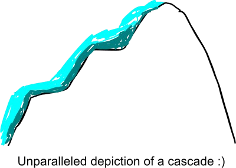
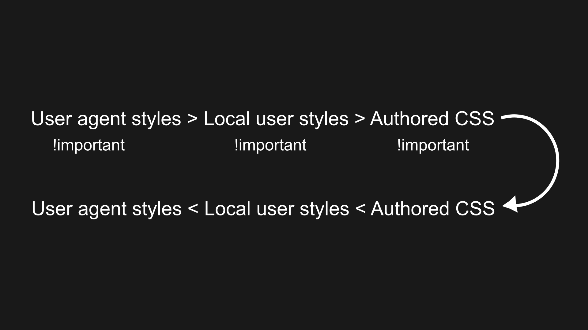

Have you ever wondered why it is called the _Cascading_ Style Sheets? Well, because CSS applies its rules like a cascade.



Just like how the water below reaches the bottom first, the rules below are the ones that get applied. Of course, it is not that simple. The rules are inherited all the way along just like how the water is accumulated at different stages. Depending on other factors, a rule written above can totally override the one below.

 
Because of this, our browsers often finds itself resloving conflicting CSS rules. For that, it uses an algorithm called _the cascade_.

In other words, the cascade is the algorithm for solving conflicts where multiple CSS rules apply to the same HTML element.

The cascade algorithm has 4 legs:

1. Order
2. Specificity
3. Origin
4. Importance

## Order

Order is perhaps the easiest one to explain. It simply means the position of the CSS rule. The rule below overrides the one previously declared.

```CSS
/* style.css */

p {
    color: red;
}

p {
    color: purple;
}
```

In the above example, the color of all paragraphs will be purple because the purple rule comes after red.

```html
<head>
  <link src="stylesheet" src="style.css" />
  <style>
    p {
      color: blue;
    }
  </style>
</head>
<body>
  <p style="color:green">lore ipsum</p>
</body>
```

In the above example, color will be green because green comes the last compared to internal styles or the stylesheet.

If you remove the inline style from the paragraph tag, the color will be blue.

If you change position of the stylesheet link to below the internal styling, the color will be purple as defined in style.css.

So the idea about the order is simple. The rule that comes last gets applied. However, there is a catch. Order can become irrelevant if specificity comes into play.

## Specificity

Specificity is the second leg of the cascade algorithm. Specificity itself is an algorithm that is used to determine which CSS rule is the most specific. For that, it uses a scoring system.

Outside the basics, specificity is quite deep and I will be writing an entirely dedicated article on it.

Specificity is the reason the following paragraph will be red instead of purple:

```html
<head>
  <style>
    div p {
      color: red;
    }
    p {
      color: purple;
    }
  </style>
</head>
<body>
  <div>
    <p>lorem ipsum</p>
  </div>
</body>
```

That's because the first rule targets paragraph inside a div compared to second one which targets all paragraphs. The first rule is more specific compared to the second one.

## Origin

The CSS we write are not the only styles that are applied to our html. There are styles from the browser, styles from the system, etc.

If there are conflicts in styles being applied to the same element but coming from different origins, certain origins are preferred over others.

There are also some changes depending on whether there is an `!important` rule being applied.

Typically there are three origins where the CSS is coming from.

1. Useragent styles
2. Local user styles
3. Authored CSS

Useragent styles are the default styles of a browser. They're applied to every HTML document. Every browser has their own useragent stylesheet.

Local user styles are styles coming from the operating system. This could also include styles from browser extensions.

Finally, authored CSS are the styles we write.

Now the order of the preference among these three orgins is that authored CSS comes first followed by local user styles and useragent styles.

So, **Authored CSS > Local User Styles > Useragent Styles**.

Unless, the `!important` rule is applied.

In this case, the above order is reversed.

**Useragent styles (`!important`) > Local User Styles (`!important`) > Authored CSS (`!important`)**

If we combine, we will get this:



As we can see that the user agent styles with `!important` rule is the most preferred while the basic user agent styles are least preferred. Everything else comes in between.

## Importance

The final leg of the cascade algorithm is importance.

> Although all CSS rules are created equal, some rules are created more equal than others.

For example, the transition rules. Transitions have to take place first because they could reveal or hide content. So transition rules are generally first preferred over other rule types.

```CSS
transition: margin-right 2s;
```

If we were to list rule types in the order of importance, it will be:

1. transitions
2. `!important` rules
3. animations
4. normal rules like `font-size`, `color`, etc
