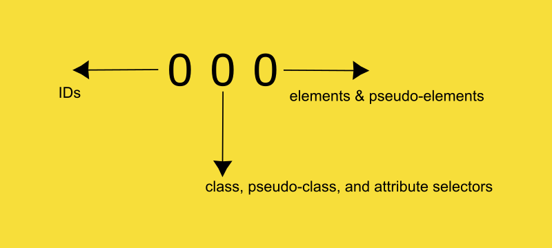
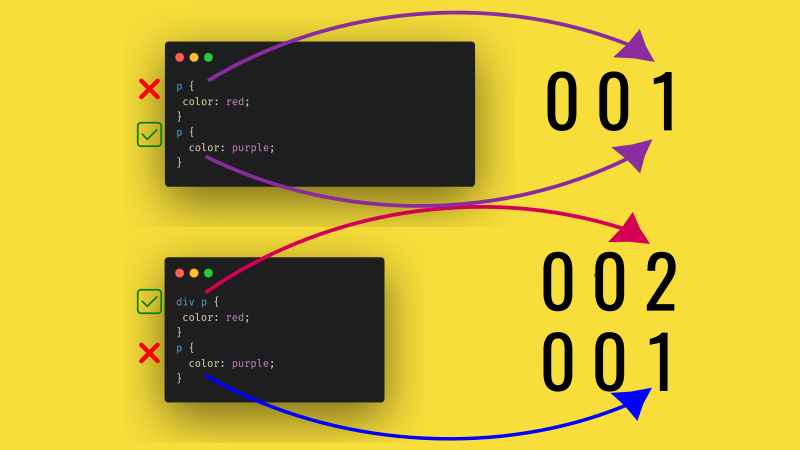

Specificity is a key part of the [cascade algorithm](css-cascade-explained). In simple words, specificity is an algorithm used to determine which CSS rule is the most specific for a particular HTML element. For that, it uses a scoring system.

In this article, we will take a deep-dive into understanding how this scoring system works and by effect, we will be learning specificity in CSS.

You may already know CSS specificity in its basic form. But believe me, there is more to it than [combining descendant selectors](https://developer.mozilla.org/en-US/docs/Web/CSS/Reference/Selectors/Descendant_combinator) to increase specificity.

Let me start by explaining the cascading effect. Imagine the following code:

```html
<head>
  <style>
    p {
      color: red;
    }
    p {
      color: purple;
    }
  </style>
</head>
<body>
  <div><p>lorem ipsum</p></div>
</body>
```

In the above case, what do you expect the color of the paragraph will be? Well, it is purple. That's because purple comes after red. This is the cascading effect in CSS. If two rules apply to the same element, then the one that comes later takes effect.

**BUT**, there is a catch. Those two rules _must_ have the same specificity.

The reason why the second rule was selected in the above case is because both are simple paragraph tags. Let's change the CSS a bit.

```html
<head>
  <style>
    div p {
      color: red;
    }
    p {
      color: purple;
    }
  </style>
</head>
<body>
  <div><p>lorem ipsum</p></div>
</body>
```

Now, the color of the paragraph will be red. Because the first selector is more specific than the second one. So the order does not matter anymore.

But how exactly does CSS know the specificity? How does CSS figure out this selector is more specific than the other one? Well, they use numbers.

CSS has a scoring system for selectors that target the same element. The more specific a selector is, higher the score will be. Only the selector with the highest score gets applied.

## The scoring system

The scoring system employed by CSS is a bit tricky. I will introducte an online calculator later in this post that will make your CSS life much easier.

For now, think of the scoring system as having 3 digits,

The first digit (from right) is the number of element and pseudo-element selectors.

The second digit is the number of class, pseudo-class, and attribute selectors.

The third digit is the number of ID selectors.



In the first case, we had the following CSS:

```CSS
p {
 color: red;
}
p {
  color: purple;
}
```

In both cases, we had only element selectors so the specificity was 001 for both.

However, for the second case,

```CSS
div p {
 color: red;
}
p {
  color: purple;
}
```

We have two element selectors in the first rule. So the specificity of first selector is 002 and second is 001. Hence the first selector was applied.



But what happens when we have a class selector?

```html
<head>
  <style>
    .para {
      color: red;
    }
    div p {
      color: blue;
    }
    p {
      color: green;
    }
  </style>
</head>
<body>
  <div>
    <p class="para">lorem ipsum</p>
  </div>
</body>
```

In this case, the first selector has specificity of 010.

The second selector has specificity of 002.

The third selector has specificity of 001.

So here the color will be red as the first selector has the highest specificity.

Now for the tricky part, what happens if we have 11 element selectors? Can it outdo a class selector?

Imagine a situation like this: (where I hope you will never find yourself in)

```html
<head>
  <style>
    .para {
      color: red;
    }
    div div div div div div div div div div div p {
      color: blue;
    }
  </style>
</head>
<body>
  <div>
    <div>
      <div>
        <div>
          <div>
            <div>
              <div>
                <div>
                  <div>
                    <div>
                      <div>
                        <div>
                          <p class="para">lorem ipsum</p>
                        </div>
                      </div>
                    </div>
                  </div>
                </div>
              </div>
            </div>
          </div>
        </div>
      </div>
    </div>
  </div>
</body>
```

In the above case, the first selector has a specificity of 010.

The second selector has a specificity of 0012 as there are 12 element selectors.

In this case, the second selector seemingly has the higher specificity and therefore should be applied, right? **NO**.

This is the tricky part of the scoring system. There is a clear order of preference. If there are class, pseudo-class, or attribute selectors, then they totally override any element or pseudo-element selectors.

If there are ID selectors, then they totally override any class, pseudo-class, attribute, element, or pseudo-element selectors.

It doesn't matter if you combine them to obtain a seemingly higher specificity score. Each digits on the specificity score are in their own league.

So, once there is a class selector, all the element and pseudo-element selectors doesn't matter anymore.

EXCEPT, if the score end up in a tie. Imagine the following scenario:

```CSS
.para {
  color: red;
}

.para {
  color: blue;
}
```

Here we have two class selectors and the specificity score for both are same. So the color will be blue because it comes second. Now let's modify the first selector:

```CSS
.para p {
  color: red;
}

.para {
  color: blue;
}
```

Here we have a match for the class selectors. But in this case, the first one also has an element selector. Because specificity is same as far as classes are concerned, element selector will take the final decision. So the color will be red.

Similarly, if we have an ID selector, the specificity score will be 100 making other two irrelevant. Unless ofcourse there is a tie for IDs.

### Specificity of universal selector

Universal selector is often used to reset useragent stylesheets. Universal selector has a specificity of 0. So, practically any selector can override styles being applied from universal selectors.

```css
* {
  margin: 0;
  padding: 0;
}

p {
  /* overrides */
  padding: 10px;
}
```

### Specificity of inline styles

The inline styles add a specificity of 1000. So it overides IDs, classes, and elements.

```html
<head>
  <style>
    #para {
      color: red;
    }
  </style>
</head>
<body>
  <p id="para" style="color:blue">lorem ipsum</p>
</body>
```

The color will be blue, because inline styling is more specific.

### Specificity of `!important` rule

The `!important` rule is often used to override styles when we have no clue how much specific we need to get. `!important` rule adds 10,000 points to specificity and overrides IDs, classes, elements, and inline styles.

```CSS
#ID {
  color: red;
}

p {
  /* higher specificity */
  color: blue !important;
}
```

`!important` rule and inline styling (even IDs at times) is considered bad practice. You must keep your CSS rules as liberal as possible so you can do more specific styling by taking advantage of the cascade.

## Exceptions

There are notable exceptions when it comes to two pseudo-classes —`:is()` and `:not()`.

The `:is()` selector accepts a list of selectors that we can apply styles. For example,

```CSS
:is(header, main, footer) p:hover {
  color: red;
  cursor: pointer;
}
```

In this case, all paragraphs that come under `header`, `main`, and `footer` will have the hover effect.

Here `:is()` itself does not have any specificity. All though all the selectors that comes inside `:is()` will have their specificity added up.

A similar exception is also granted to `:not()` pseudo-class.

The `:not()` pseduo-class accepts a list of selectors that we can avoid styles from being applied.

```CSS
:not(p) {
  color: blue;
}
```

In this case, all paragraph elements will be avoided from being applied the color blue.

Here too, the `:not()` pseduo-class doesn't increase specificity. But selectors inside does.

## Final remarks

In short, CSS uses a scoring system to decide which selector is more specific. Whichever selector has higher score gets applied.

The score is mainly made of 3 digits - score contributed by element/pseudo-element selectors, classes/pseudo-classes/attribtute selectors, and IDs.

Inline styling will override all the 3 of the above which in fact gets overwritten by `!important` rule.

The best practice is to stick to classes and element selectors to apply your styles.

And keep your styles the least specific as possible so more specific styles can be added later.

Links: https://specificity.keegan.st/ (specificity calculator)
