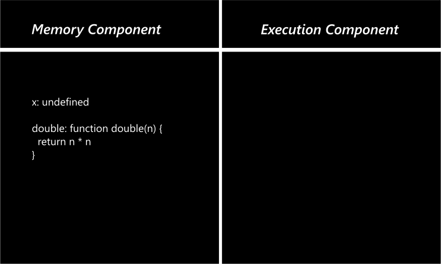
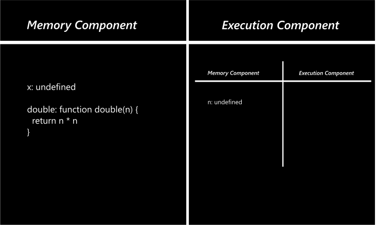
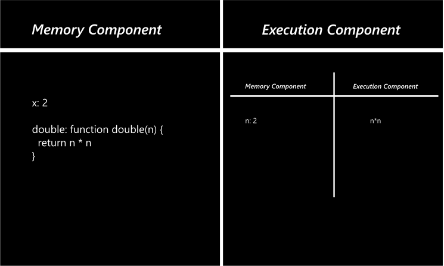
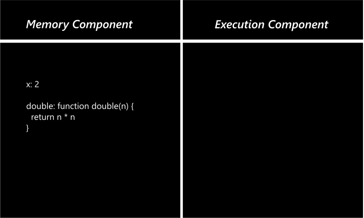

Okay, today I want to breakdown one of the much debated topics in JavaScript — _hoisting_. Many people believe hoisting is "lifting" variables and functions to top of the file during execution. If I had to teach JavaScript to 5 years olds, I would stick with that definition.

But since I am not teaching to 5 year olds, hopefully, I would rather define hoisting as a process that JavaScript engines undergo to prepare for an execution. Although that definition is also a bit bloated, a better way to see hoisting is to see it as stage 1 of JavaScript execution.

Regardless of how you see it, it is **not** lifting variables or functions to top of the file.

## JavaScript Code Execution

Two things has to be kept in mind when it comes to JavaScript execution:

1. JavaScript is synchronous (executed one line at a time)
2. JavaScript is single-threaded (executed in specific order)

When JavaScript is executed, the whole execution takes place inside an _execution context_.

Execution context is simply a container that stores all the information required for the execution. Basically, it stores the variables and functions.

Execution context have two components and each component deals with each phase of execution itself.

1. Memory allocation phase
2. Execution phase

### Memory allocation phase

In this phase, all variables and functions are stored in the memory allocation component of the execution context. They're stored in key-value pairs.

For variables, value `undefined` is given as a placeholder. For functions, the entire code is copied into memory.

### Execution phase

In this phase, the code is simply executed. It happens in the execution component of the execution context.

At first, the global context is created. Then this process is repeated for each functions as the code is run.

Let's learn it better with an example. Imagine the following piece of code.

```js
var x = 2

function double(n) {
  return n * n
}

double(x) // 4
```

In the above case, first the global execution context is created and it will look like this:



Then a local execution context is created for the function itself.



Now the code will be executed line by line. For that, all variables both in global and local context is assigned their value and function is executed.



When the return statement is encountered, the control is given back and the temporary execution context created for the function is deleted.



This process is repeated for each and every function. So it actually forms a stack called _call stack_.


Global context goes at the bottom of the stack. Then each contexts are stacked on top of each other. As javascript is executed, each context is removed one by one until finally the global context is removed where the execution ends.

## Hoisting

Now that we know how javascript code execution works, you might have already identified the process of hoisting. It is simply allocating memory for variables and functions in key:value pairs.

One thing to note is that hoisting actually takes place for each [scope](/javascript-scope-an-easy-explanation). First it happens with global scope, then for each function scopes, class scopes, etc.

If you don't properly understand the concept of hoisting, then you're prone to write programs that are buggy. So, we will take a case by case look of variable, function, and class hoisting.

### Variable hoisting

Variable hoisting is done to split variable declaration and initialization. Declaration is when the memory is allocated to the variable and initialization is when the value is assigned.

So, if we declare the variable before initialzing, or if we initialize the variable before declaring, or we instantly declared and intialized the variables in the same line, we can expect the behavior to be more or less the same.

Because javascript engines will always declare the variables first and values are only initialized at the time of execution completely depending on the scope of that execution.

In the above example, we saw how that works. However, we used `var` declaration which has behavioral changes compared to more modern `let` and `const` keywords.

#### `var` hoisting

When a variable is declared using `var`, it is initialized with value `undefined` during hoisting.

```js
var x
x = 10

y = 10
var y

var z = 10
```

In all the above cases, the variables `x`, `y`, and `z` are hoisted with value undefined.

#### `let` and `const` hoisting

For `let` and `const`, the variables are hoisted just like `var` but they're not initialized with a default value.

```js
let x = 10

const y
y = 20

let z = 30
```

In the above case, all variables will be hoisted but no default value will be given. The difference is that, if you have a function that uses any of these variables but is declared before the variable is initialzed, unlike variables declared using `var` — `let` and `const` will throw an error because they do not have a value.

```js
console.log(x) //undefined
var x = 10
```

In the above case, we declared `x` using `var`. So during hoisting, `x` will be given the value `undefined` which is logged in the console. Then `x` is initialized with value 10.

```js
console.log(x) // ReferenceError
let x = 10
```

In this case, we got a reference error because we declared the variable using `let`. Although the variable is hoisted, no value is initialized. The same applies to `const`.

This is why we are better of using `let` and `const` instead of `var`. Because if we happen to have a code like above where the variable is declared and initialized after the function, it will throw an error.

Having `undefined` as value means there will be no error and you'll be on your own to figure out what went wrong.

### Function hoisting

As you already saw in the example, functions are also hoisted. Function hoisting is simply storing the function's code in key:value pair. The key will be the function name. The side-effect of function hoisting is that you can actually call the function before it is defined.

```js
sayHello() // "Hello"

function sayHello() {
  console.log("Hello")
}
```

In the above case, the function is called before the declaration but it still works due to hoisting. To avoid this, you can actually use function expressions.

```js
sayHello() // ReferenceError

const sayHello = function () {
  console.log("Hello")
}
```

A function expression is simply storing the function in a variable. They're are not hoisted hence cannot be used before delcaring.

### Class hoisting

In javascript, `class` declarations are also hoisted. However, unlike function delcarations, values for classes are not initialized hence giving reference error.

```js
const p = new Rectangle() //ReferenceError

class Rectangle {
  constructor(height, width) {
    this.height = height
    this.width = width
  }
}
```

Just like function expressions, class expressions can also be made by assigning a class to a variable. However, class declarations and class expressions are both hoisted the same way so there are no behavioral changes.

## Avoiding hoisting bugs

Hoisting bugs can be avoided if you,

- Declare and initialize variables before they are used
- Declare functions or classes before they're used
- Stick to `let` and `const` instead of `var`

In addition, you must always be aware of the global context and local context of each functions. Since values are only assigned at the time of execution, it is important that all such assigments happen before a function call. Keep in mind that javascript is synchronous and single threaded. So everything is executed line by line and in specific order. Try to always visualize this order of execution when you're writing the program and it will help reduce/solve hoisting and related problems.
