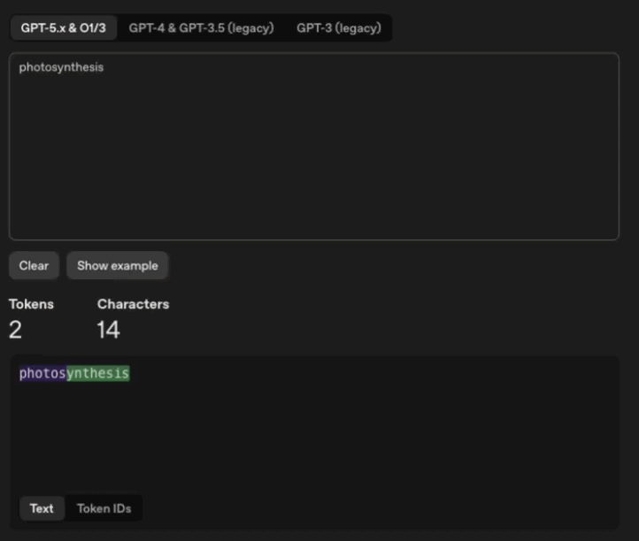
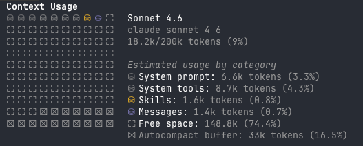
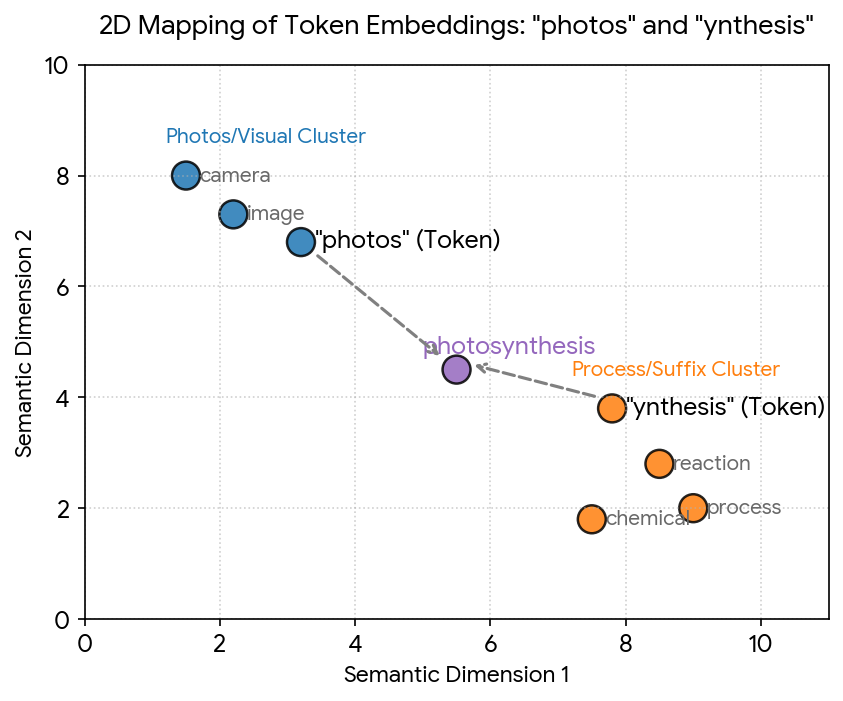
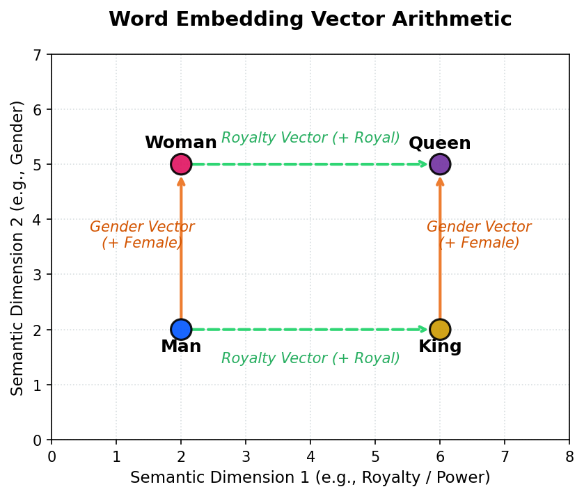

AI tools have become the default way to get things done. They've captured the imagination of people in nearly every field - developers, designers, researchers, architects, writers, _you name it_. Yet most people never learn the basics of how an LLM works, the basics that **_will_** set them apart from the crowd.

The goal of today's post is to teach you one such fundamental concept - _**LLM tokens**_. The article uses simple language for both technical and non-technical readers.

The ulterior motive of this article is to help you get started with context management. Lacking it is the primary reason why your AI agent bails out on quality output. Along the way, we'll dive into "lost in the middle" problems, hallucinations, and surface-level understanding of how LLM works.

This article grew out of a few other pieces I tried to write about context management. Each one kept leaning on a concept I’d never properly explained - so that concept earned its own post first.

<PullQuote eyebrow="what's coming" align="left">
  Think of this article NOT as your context management guide, but as where to
  even begin looking for one.
</PullQuote>

## Why am I paying for tokens, not words?

Let's start with a question you've probably asked yourself before, especially if you've ever used an API endpoint or a paid subscription. Your usage is calculated based on _token_ consumption, not word count. The reason is simple: LLMs don't understand full words. They only understand parts of it. This "part" is called a token, which is usually around 0.75 word.

When you write a prompt in the chat and hit enter, the first thing your prompt hits is an API endpoint that converts your input text into LLM tokens. It's these tokens that get sent to the LLM.

Let's take the word **photosynthesis**. If you tokenize the word using [OpenAI Tokenizer](https://platform.openai.com/tokenizer), you will get two tokens - `photos` & `ynthesis`.

<Mermaid content={`
flowchart TD
    A["Photosynthesis"] --> B & C
    B["Photos\nToken 1"]
    C["ynthesis\nToken 2"]

    style A fill:#1e1e2e,stroke:#555,color:#cdd6f4
    style B fill:#1e1e2e,stroke:#7c3aed,color:#a78bfa
    style C fill:#1e1e2e,stroke:#059669,color:#6ee7b7

`} />

So when you enter the word **photosynthesis** to ChatGPT, the single word will cost you 2 tokens. That's because LLMs learn a fixed dictionary of patterns, not whole words.

In this case, **photos** is a standalone word. The word **ynthesis** is a fragment that shows up across words like synthesis, biosynthesis, speech-synthesis, and more.

If you switch to the token IDs tab, you will see two numbers - **52597** & **73972**.

It's not _photos_ & _ynthesis_ that get sent to the LLM, it's these numbers. That's a more technical tangent we'll take later in this article. You don’t need it to follow along, but it helps

<Callout type="tip">
  It's worth building an intuition for how your words break into tokens.
  OpenAI's tokenizer, [tiktoken](https://github.com/openai/tiktoken), is open
  source - or you can use the tokenizer site linked above. Anthropic offers a
  free [API
  endpoint](https://platform.claude.com/docs/en/build-with-claude/token-counting)
  that returns token counts too.
</Callout>

## Why tokens? Why not words?

By this time, you're probably asking this question. After all, it should potentially bring down your cost as the token count will become the same as the word count.

While it does sound straightforward, it quickly breaks when you think about the number of words that are out there. Just in the English language, if you take all the words, technical terms, medical jargon, and slang, the total entries would easily top 1 million.[^1] It grows exponentially higher when you think about supporting other languages.

But if you only take the patterns, suddenly the number goes down to just ~100k. The `cl100k_base` encoder from OpenAI (GPT-4) has 100,261 tokens. This is a 10x reduction from the 1 million words. And of course, a 10x reduction in the VRAM usage of an expensive GPU.

To truly appreciate how much VRAM is being saved, you need to understand [_word embeddings_](#word-embeddings), which we’ll get to shortly. But the quick version is that we take up a ton more memory to store the meaning of each word in a given context.

How much more memory? In a modern LLM, each word could take 4000+ distinct numbers just to store its contextual meaning. So one less word in the LLM vocabulary is freeing up space for 4000+ distinct numbers that we would have needed to store their meaning. Now put the 10x reduction in this perspective - It'll become clear that tokenization is the only viable way to build a workable LLM.

<Callout type="fact">
The reason we can misspell words and LLMs would still understand us is because of tokenization. The vocabulary is about patterns, not words. LLMs can still put together the actual word just by calculating the statistical probability of how close each token is in the training data.

But misspelling words might cost you more tokens. If you write `photosynthesi` instead of `photosynthesis`, you will break it into three tokens, not two. Try it yourself.

</Callout>

<Callout type="fact">
  Researching this topic reminded me of a video from my favorite school days
  YouTuber _Vsauce_. The video is titled [The Zipf
  Mystery](https://www.youtube.com/watch?v=fCn8zs912OE). It will offer some
  entertaining insights after the long article.
</Callout>

## The concept of context

I’ll take the liberty of assuming that you have understood tokens. And your mental model so far looks something like this:

<Mermaid content={`
flowchart LR
    A["photosynthesis"] --> B["photos\n(Token 1)"] & C["ynthesis\n(Token 2)"]
    B --> D["52597"]
    C --> E["73972"]
    D & E --> F["🧠 LLM"]

    style A fill:#1e1e2e,stroke:#555,color:#cdd6f4
    style B fill:#1e1e2e,stroke:#7c3aed,color:#a78bfa
    style C fill:#1e1e2e,stroke:#059669,color:#6ee7b7
    style D fill:#1e1e2e,stroke:#7c3aed,color:#a78bfa
    style E fill:#1e1e2e,stroke:#059669,color:#6ee7b7
    style F fill:#1e1e2e,stroke:#f59e0b,color:#fcd34d

`} />

Now it's time to soft-land you into the concept of **_context_**.

Context in LLMs means the same thing as in everyday life. It's all the information you need to process reality at any given moment. In LLM's case, it is simply all the tokens in your current chat instance.

LLMs, however, have a **_context window_** within which they will give you good results.

There is a hidden prompt that you may not see, which already consumes part of your context window. It's called a **_system prompt_**. It's a helpful message that sets up the AI assistant before it reads your prompt.

What you see below is the `/context` visualization from my personal Claude Code subscription. It is an empty session, and the system prompt already consumes 6.6k tokens. Outside system prompt, there is a handful of other things that have eaten up my context window. They may or may not be valid for you depending on the tools you're using.

That’s 18.2k tokens before I’ve said a word. As I exchange messages with the LLM, each turn gets tokenized and appended to the context, filling it up.

Here’s what happens to your token count as you go back and forth with the LLM:

<Mermaid content={`
sequenceDiagram
    participant You
    participant LLM

    Note over You,LLM: Context: 18K tokens
    You->>LLM: Message 1
    LLM-->>You: Response 1
    Note over You,LLM: Context: ~21K tokens

    You->>LLM: Message 2
    LLM-->>You: Response 2
    Note over You,LLM: Context: ~25K tokens

    You->>LLM: Message 3
    LLM-->>You: Response 3
    Note over You,LLM: Ctx: ~30K tokens → 200K ⚠️

`} />

There is a hard cap of 200K tokens for the `claude-sonnet-4-6` model. This is the maximum number of tokens the LLM can process at **_once_**. Anything above 200K, and Claude will compact your context.

That ceiling exists because LLMs grow less efficient as the context fills up. We'll discuss _why_ down the line.

<Callout type="tip">
  This [GitHub
  Repo](https://github.com/x1xhlol/system-prompts-and-models-of-ai-tools)
  contains system prompts from different models and AI tools.
</Callout>

<Callout type="warning">
LLM compaction is lossy, and bad things can happen if you lose a critical piece of information during compaction. It will also cost additional tokens to compact your current session.

</Callout>

## Why does your session consume too many tokens?

It is time to address the elephant in the room. You're reading this because you probably want to accomplish two things:

1. Reduce token usage
2. Improve LLM output

But I will be honest with you. This article only answers _why_ you have high token usage and bad quality output. Not how to fix it. That will be a case-by-case scenario, and I will most certainly write an article regarding coding soon.

This, however, is the foundation of the context management skill. **_Think of this article NOT as your context management guide, but as where to even begin looking for one._**.

So then, why do your sessions consume too many tokens? You already have one part of the answer. The token count is much bigger than the word count. But there is more. And that is a perception issue created by the chat interface.

Every time you send a message to an LLM, you're not just sending the current text. You're also sending your entire history. After each passing message, your history becomes bloated with previous conversations. Which is FULLY processed on each call to the LLM.

In the flow chart below, each row indicates what you're sending to the LLM after each successive message.

<Mermaid content={`
flowchart TD
    T1["Turn 1\nM1"]
    T2["Turn 2\nM1 · R1 · M2"]
    T3["Turn 3\nM1 · R1 · M2 · R2 · M3"]
    T4["Turn 4\nM1 · R1 · M2 · R2 · M3 · R3 · M4"]

    T1 --> T2 --> T3 --> T4

    style T1 fill:#1e1e2e,stroke:#555,color:#cdd6f4
    style T2 fill:#1e1e2e,stroke:#7c3aed,color:#cdd6f4
    style T3 fill:#1e1e2e,stroke:#059669,color:#cdd6f4
    style T4 fill:#1e1e2e,stroke:#dc2626,color:#fca5a5

`} />

So if your context holds 100K tokens, your next message will burn ~120K tokens. And the message after that burns ~140k tokens. This is why you hit your daily limit fast.

Large context also triggers the _lost in the middle_ problem that derails output quality.

<Callout type="note">
  Some innovations like [prompt
  caching](https://www.claudecodecamp.com/p/how-prompt-caching-actually-works-in-claude-code)
  and real-time [Websocket
  API](https://openai.com/index/speeding-up-agentic-workflows-with-websockets/)
  have partly tackled this issue.
</Callout>

## Lost in the middle

We understood tokens, why they exist, how they're made, and the reason why your LLM limit gets hit easily. Now we need to understand a phenomenon called **_lost in the middle_**.

This phenomenon is the reason why the quality of your LLM's output goes down as your context window fills up.

This is because LLMs tend to remember things that were said in the beginning (primacy bias) and in the end (recency bias). But it fails to retrieve context in the middle, hence _"lost in the middle"_.[^2]

Below is a generalized graph of how much attention LLM pays across the full span of the context.

<Mermaid
  content={`
xychart-beta
  title "LLM Attention Across Context Window"
  x-axis ["Start", "Early", "Middle", "Late", "End"]
  y-axis "Attention (%)" 0 --> 100
  line [92, 48, 18, 45, 88]
`}
/>

This is a structural issue baked into LLM architecture. The attention mechanism relies on next-word prediction, creating recency bias.[^2] Training on data like StackOverflow posts where questions precede answers, the model develops primacy bias as an emergent property.[^2]

To take the point home, as the context grows, there are diminishing returns. So keep your context as small and precise as possible.

<Callout type="fact">
  Interestingly, this behavior of LLMs is a mirror of human psychology. We
  ourselves have both recency and primacy bias. However, in the case of LLMs,
  they're mathematically capable of retrieving any token in the context with
  equal ease. So it is theoretically possible to fix this, and solutions are
  being worked on.
</Callout>

## Hallucinations

While your LLM does not have sleep loss or consume psychedelics, it still hallucinates. The LLM's architecture forces it to predict the next word, whether it knows the answer or not. So it will confidently return results even if it doesn't have the answer in its training data. This phenomenon is known as hallucination, a mathematical inevitability.[^3]

Comparing LLM hallucinations to human ones is intriguing. But with humans, the brain is malfunctioning. With LLM, it is doing exactly what it is supposed to do. LLM's "hallucinations" are hallucinations _ONLY_ as far as humans are concerned. That matters because the way to avoid them is proper training data, fine-tuning, and a surgically precise context.[^3]

The "lost in the middle" phenomenon we discussed earlier is a massive trigger for your LLM to hallucinate. Because it will confidently give output even though it might not have considered the entire context equally. Once it hallucinates a bit, the recency bias will trigger a snowball effect of hallucinated responses, and you're better off just starting a new session.

<Mermaid content={`
flowchart TD
    A["🧠 LLM predicts\nnext token"] --> B["Lost in the middle\nContext ignored ⚠️"]
    B --> C["Confident wrong\nanswer generated"]
    C --> D["Bad answer enters\ncontext window"]
    D --> E["Next prediction\nbuilt on bad data"]
    E --> F["Hallucination\ncompounds..."]
    F --> |"snowball"| C

    style A fill:#1e1e2e,stroke:#555,color:#cdd6f4
    style B fill:#1e1e2e,stroke:#f59e0b,color:#fcd34d
    style C fill:#1e1e2e,stroke:#dc2626,color:#fca5a5
    style D fill:#1e1e2e,stroke:#dc2626,color:#fca5a5
    style E fill:#1e1e2e,stroke:#7c3aed,color:#a78bfa
    style F fill:#1e1e2e,stroke:#dc2626,color:#fca5a5

`} />

<Callout type="tip">
  Larger LLMs typically hallucinate less because of large training data and
  query-aware contextualization. You should check the recommended context window
  limits of the LLMs you're using.
</Callout>

<Callout type="tip">
  If you constantly find your LLM agent to be hallucinating, or you just want to
  try out different versions of a design or architecture you're building with an
  LLM, learn about **_context forking/branching_**. They're beyond the scope of
  this article. But there is plenty of information online.
</Callout>

## How LLM tokens are processed [^4] [^5]

Great, I grant that you've understood tokens, context windows, the lost in the middle phenomenon, hallucinations, and more. In this section, we will have a technical deep-dive in to how LLMs work. This is a beginner-friendly take intended to develop intuition. We'll be name-checking some algorithms and what they do for us. But we'll not be discussing the underlying math in any way. **_It is more important that we understand the consequences of the math than understanding the math itself_**. That part is mostly covered.

### Word Embeddings

In the very first section, when we were discussing tokenization, we came across this:

<Mermaid content={`
flowchart LR
    A["photosynthesis"] --> B["photos\n(Token 1)"] & C["ynthesis\n(Token 2)"]
    B --> D["52597"]
    C --> E["73972"]
    D & E --> F["🧠 LLM"]

    style A fill:#1e1e2e,stroke:#555,color:#cdd6f4
    style B fill:#1e1e2e,stroke:#7c3aed,color:#a78bfa
    style C fill:#1e1e2e,stroke:#059669,color:#6ee7b7
    style D fill:#1e1e2e,stroke:#7c3aed,color:#a78bfa
    style E fill:#1e1e2e,stroke:#059669,color:#6ee7b7
    style F fill:#1e1e2e,stroke:#f59e0b,color:#fcd34d

`} />

We know why we need to rely on these patterns, but what are these numbers?

Earlier, I mentioned that 1 million words[^1] in the English language get tokenized into just 100k+ patterns. Inside the LLM, these 100k+ tokens are in a giant lookup table with a row for each token. The numbers we got above are the row numbers of those specific tokens in the lookup table.

| Token    | Row ID  | Vector                          |
| -------- | ------- | ------------------------------- |
| ...      | ...     | ...                             |
| photos   | 52597   | [0.23, -1.41, 0.87, 1.05, ...]  |
| ...      | ...     | ...                             |
| ynthesis | 73972   | [1.02, 0.15, -0.63, -0.44, ...] |
| ...      | ...     | ...                             |
| ...      | 100,261 | ...                             |

You've probably noticed the random numbers I added next to the corresponding row. These numbers form the **_embedding vector_**. Each number in this vector represents a language feature like semantics, concept, or grammatical traits.

When imagining these vectors in space, these numbers become **_dimensions_**. Each token has a fixed number of dimensions. And they're usually in the 1000s for a modern LLM. These numbers keep the contextual meaning of the token in relation to other tokens. Before we talk about how we get these numbers, let’s first get a feel for how they encode meaning.

The easiest way to intuitively understand is to visualize them in vector space. But visualizing a space with 1000s of dimensions is not humanly possible. So let's tone it down to just two.

In the above example, we have two semantic dimensions. When you plot the token _photos_, it is near word clusters like camera, image, while the token _ynthesis_ is near words like reaction, process, or chemical.

We can understand the meaning of one word in relation to other words just by calculating the distance between them. Shorter distance means they're closer together.

Here is an example to understand the semantic connection better.

We have 2 dimensions - gender & royalty. The distance between "man" & "woman" is close along the gender dimension. The distance between "man" & "king" is close along the royalty dimension. Same for "women" & "queen". You can see the distance of "king" and "women" is farther away, and vice versa.

So when the computer steps from “man” along the gender dimension, it reaches “woman.” Step from “man” along the royalty dimension and it reaches “king.” That’s how an LLM links “man” to “king” - and “woman” to “queen” - through simple arithmetic.

The 2-dimensional example clarifies the concept, but real LLMs use thousands of fixed dimensions per token to encode their contextual meaning.

**_So how are these numbers arrived at?_** These are the general steps:

1. First, we create a vocabulary of tokens by using an algorithm called [Byte Pair Encoding](https://www.youtube.com/watch?v=tOMjTCO0htA).
2. For each token, we create a vector with random values like [0.01, 0.02, -0.04...]. There will be 1000s of these random values.
3. Then we start training on a large corpus of text where the values automatically adjust themselves to produce the relationships we saw in the images above.

I'll add to **point #3** in the upcoming section.

### Attention is all you need

If you're the more nerdy type, you already know where this title came from. If you haven't heard of it and still made it this far, the title comes from a famous 2017 Google paper: [Attention Is All You Need](https://proceedings.neurips.cc/paper_files/paper/2017/file/3f5ee243547dee91fbd053c1c4a845aa-Paper.pdf).

This paper popularized the **_Transformer_** architecture, which is the brain behind modern LLMs. Originally written for language translation, the same transformer technology powers today's LLMs.

Explaining transformer architecture will need its own posts (plural), and this is a beginner post intended to develop intuition to use an LLM. I also believe others have already done a better job [explaining the underlying math](https://www.youtube.com/watch?v=aircAruvnKk&list=PLZHQObOWTQDNU6R1_67000Dx_ZCJB-3pi).

But for the sake of completion of this article, a typical prompt processing by an LLM will have this flow:

<Mermaid content={`
flowchart LR
    A["Input Tokens"] --> B["Embedding Matrix"]
    B --> C["Transformer Blocks"]
    C --> D["Output Token"]

    style A fill:#1e1e2e,stroke:#555,color:#cdd6f4
    style B fill:#1e1e2e,stroke:#7c3aed,color:#a78bfa
    style C fill:#1e1e2e,stroke:#059669,color:#6ee7b7
    style D fill:#1e1e2e,stroke:#dc2626,color:#fca5a5

`} />

We already know what an input token is and have a grasp of the embedding matrix (= embedding vector).

The transformer block consists of 3 matrices - Query, Key, & Value. Just like the embedding vector we discussed earlier, these are also 1000+ dimensional matrices with adjusted numbers from the training.

It helps to think of these matrices conceptually.

- The query matrix holds the semantic meaning of a token.
- The key matrix holds the grammatical role of a token.
- The value matrix holds raw information stripped of context.

When you multiply them, you tend to reinvent patterns in your training data, which gives you the LLM output.

That was easier said than done, but in reality, there is a lot more going on. As someone using LLMs for productivity, you don't have to know them. You just need to build some intuition on how it works underneath so as to understand its behavior on the surface.

Before I leave you with a much more honest flowchart than the one above, I want you to take away this point:

**_The whole LLM process comes down to this: generate a bunch of matrices from the training data. You multiply those matrices to get back the trained input, but with the direction dictated by your prompt message_**.

And the flow chart:

<Mermaid content={`
flowchart TD
    A["Input Tokens\n52597 · 73972 · ..."] --> B["Embedding Matrix\ntoken ID → vector"]
    B --> C["+ Positional Encoding\nadd position info"]
    C --> D["Transformer Blocks\nself-attention + feed-forward"]
    D --> |"repeated N times"| D
    D --> E["Linear Layer\nvectors → vocab logits"]
    E --> F["Softmax\nlogits → probabilities"]
    F --> G["Output Token\nnext most likely token"]

    style A fill:#1e1e2e,stroke:#555,color:#cdd6f4
    style B fill:#1e1e2e,stroke:#7c3aed,color:#a78bfa
    style C fill:#1e1e2e,stroke:#7c3aed,color:#a78bfa
    style D fill:#1e1e2e,stroke:#059669,color:#6ee7b7
    style E fill:#1e1e2e,stroke:#f59e0b,color:#fcd34d
    style F fill:#1e1e2e,stroke:#f59e0b,color:#fcd34d
    style G fill:#1e1e2e,stroke:#dc2626,color:#fca5a5

`} />

This flow chart is intended for curiosity's sake; anything I can add is irrelevant to this post.

That being said, I will add to **point #3** from the previous section. The transformer matrices are also assigned random numbers at the beginning. The values get adjusted during training using an algorithm called **_backpropagation_**.

[Backpropagation](https://www.youtube.com/watch?v=Ilg3gGewQ5U) is how LLMs learn, and if I were to jump from here for a more technical deep-dive, it is where I'll start.

## Output vs Input token

Let's wrap it up by discussing the [pricing difference](https://platform.claude.com/docs/en/about-claude/pricing) between output & input tokens. As you see above, generating output tokens requires enormous compute. So they cost significantly more than input tokens.

For all Claude Opus models, the output tokens are 5x more expensive than the input tokens. It is important to specify the exact shape of the output you want. Apart from helping keep the context clean, it will have a sizable impact on your bill.

[^1]: [English hits million-word milestone](https://www.theguardian.com/books/2009/jun/10/english-million-word-milestone) — The Guardian

[^2]: [Lost in the Middle: How Language Models Use Long Contexts](https://arxiv.org/pdf/2307.03172) — Liu et al., 2023

[^3]: [Hallucination is Inevitable: An Innate Limitation of Large Language Models](https://arxiv.org/pdf/2401.11817) — Xu et al., 2024

[^4]: [Attention Is All You Need](https://proceedings.neurips.cc/paper_files/paper/2017/file/3f5ee243547dee91fbd053c1c4a845aa-Paper.pdf) — Vaswani et al., 2017

[^5]: [Neural Networks — 3Blue1Brown](https://www.youtube.com/playlist?list=PLZHQObOWTQDNU6R1_67000Dx_ZCJB-3pi)
